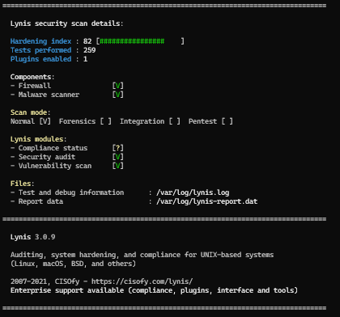

# 🛡️ Hardening de Infraestructura Linux - Framework LMTM v2.1

**Hardening Index:** 82/100 🛡️ | **Nivel:** Fuerte 💪 | **Arquitectura:** Modular 🏛️

Framework profesional de securización automatizada para entornos **Debian/Ubuntu Server**. Este ecosistema de scripts y configuraciones eleva la postura de seguridad de un sistema a un **Hardening Index de 82/100**, eliminando vectores de ataque críticos identificados por la metodología de auditoría de **Lynis**.

**Autora:** Luz María Talavera Martínez  
**Fecha:** 14 de abril de 2026  
**Guía Metodológica:** Consultoría Avanzada Humano-IA

---

## 🤖 Ingeniería de Seguridad Asistida por IA

Este proyecto trasciende la ejecución de comandos simples; es el resultado de un proceso de **Ingeniería de Prompts y Consultoría Técnica Iterativa**. La Inteligencia Artificial fue integrada en el ciclo de vida del desarrollo como un **Arquitecto de Seguridad Senior**:

*   **Análisis de Hallazgos:** Interpretación semántica de los reportes de Lynis, priorizando controles basados en el impacto sobre la tríada de la seguridad (Confidencialidad, Integridad y Disponibilidad).
*   **Resolución de Conflictos de Kernel:** Ajuste fino de parámetros en `sysctl.conf` para cumplir con las exigencias del auditor sin degradar la conectividad de red.
*   **Automatización de Cifrado:** Desarrollo de lógica en Bash para la captura y despliegue dinámico de hashes PBKDF2 para la protección del GRUB.
*   **Diseño de Herramientas Auxiliares:** Creación de un servidor forense en Python optimizado para la extracción segura de logs.

---

## 🛠️ Pilares Técnicos (Hardening Index 82)

### 1. Networking & Kernel Tuning (LMTM-NetCore)
*   **Protección ICMP:** Desactivación de *redirects* para mitigar ataques de envenenamiento de ruta (MitM).
*   **RFC 3704 Filtering:** Activación de filtrado de ruta inversa para prevenir el IP Spoofing.
*   **Protocol Hardening:** Remoción de soporte para protocolos obsoletos (TIPC, USB Storage).

### 2. Acceso y Autenticación (LMTM-Auth)
*   **OpenSSH Hardening:** Desactivación de login por Root, restricción de `MaxAuthTries` a 3 y eliminación de banners de versión.
*   **Criptografía:** Escalado de hashing en `/etc/login.defs` a SHA512 con **10,000 rondas**.
*   **PAM Quality:** Implementación de librerías para forzar la complejidad de contraseñas.

### 3. Seguridad del Arranque y FileSystem
*   **Boot Security:** Protección total del gestor de arranque GRUB mediante credenciales administrativas cifradas.
*   **Integridad de Archivos:** Configuración de `Auditd` para monitorear archivos de identidad (`/etc/passwd`) y privilegios (`/etc/sudoers`).


---

## 🆙 Novedades de la Versión v2.2 (Refactorización Senior)
Esta versión se enfoca en la **portabilidad** y la **seguridad de credenciales**, eliminando dependencias de rutas estáticas y mejorando el manejo de secretos:

*   **Portabilidad Dinámica (BASE_DIR):** Se implementó lógica de detección de rutas absolutas. El framework ahora es independiente de la ubicación de descarga, garantizando un despliegue exitoso desde cualquier directorio.
*   **Gestión de Secretos en Vivo:** Eliminación de hashes estáticos (*hardcoded*) en el script. El sistema ahora genera **hashes PBKDF2 en tiempo real** durante la instalación, personalizando la seguridad del GRUB para cada usuario.
*   **Optimización de Auditoría:** Integración definitiva de **Lynis 3.1.2** como motor de validación post-despliegue.
*   **Limpieza de Superficie de Ataque:** Remoción total de servicios de impresión y optimización de permisos en logs de auditoría.


---


## 📊 Evidencia de Auditoría
Tras la aplicación del framework, se obtuvo una calificación de **82/100** en el Hardening Index, validando la eficacia de los controles implementados.



*Figura 1: Resultado final de la auditoría de seguridad realizada con Lynis.*


## 📂 Estructura del Ecosistema

*   📄 [**install.sh**](./install.sh) - Orquestador Maestro: Lógica de despliegue y validación.
*   📁 [**config/**](./config/) - Blueprints de configuración endurecida.
    *   📄 [sysctl.conf](./config/sysctl.conf) | [audit.rules](./config/audit.rules) | [sshd_config](./config/sshd_config) | [40_custom](./config/40_custom)
*   📁 [**scripts/**](./scripts/)
    *   📄 [auto_audit.sh](./scripts/auto_audit.sh) - Script de mantenimiento semanal.
*   📁 [**tools/**](./tools/)
    *   📄 [report_server.py](./tools/report_server.py) - Servidor Python de extracción forense.
*   📁 [**docs/**](./docs/)
    *   📄 [HARDENING_DETAILS.md](./docs/HARDENING_DETAILS.md) - Documentación técnica detallada.

---

## 🤖 Mantenimiento y Auto-Auditoría
El framework incluye un sistema de vigilancia continua programado mediante **Cron**:
*   **Frecuencia:** Todos los domingos a las 00:00.
*   **Acción:** Ejecución automatizada de Lynis (modo quick).
*   **Logs:** Reportes en `/var/log/lynis_report_YYYY-MM-DD.txt`.

## 📈 Roadmap de Seguridad (Fase 3.0)
Para elevar el score a 90+, se sugieren implementaciones a nivel de particionado inicial:
- **Segmentación LVM:** Aislamiento de `/var`, `/home` y `/tmp`.
- **Cifrado LUKS:** Protección de datos en reposo (Full Disk Encryption).

## 🚀 Guía de Despliegue Rápido

```bash
git clone https://github.com/LuzTalaveraMartinez/Hardening-Infraestructura-LMTM
cd Hardening-Infraestructura-LMTM
chmod +x install.sh
sudo ./install.sh
